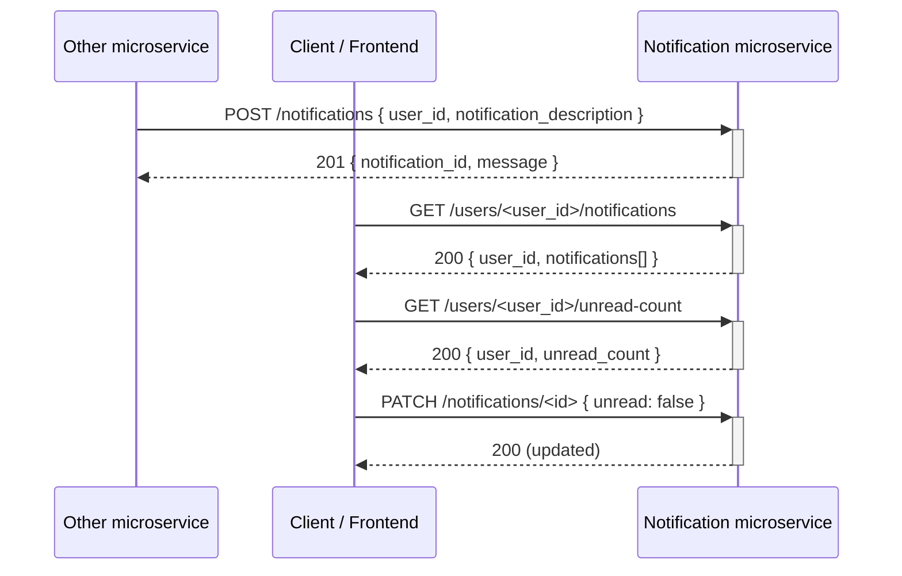

# Notification Microservice

A small notification Python + Flask API. Receives notifications from other microservices, provides notification list and count, and allows for updating
of read/unread status.

## Setup

```bash
python -m venv venv
source venv/bin/activate   # Windows: venv\Scripts\activate
pip install -r requirements.txt
```

## Run

```bash
python app.py
```

## API

| Method | Endpoint | Description |
|--------|----------|-------------|
| POST | `/notifications` | Receive a notification. Body: `{"user_id": "...", "notification_description": "..."}` |
| GET | `/users/<user_id>/notifications` | Get all notifications for a user (newest first) |
| PATCH | `/notifications/<notification_id>` | Mark as read/unread. Body: `{"unread": true}` or `{"unread": false}` |
| GET | `/users/<user_id>/unread-count` | Get unread notification count for a user |

## How to programmatically REQUEST data (REST API)

Example: get all notifications for a user.

| Method | URL |
|--------|-----|
| GET | `http://127.0.0.1:8001/users/<user_id>/notifications` |

Requesting that data in Python:

```python
import requests

user_id = "alice"
response = requests.get(f"http://127.0.0.1:8001/users/{user_id}/notifications")
```

## How to programmatically RECEIVE data (JSON)

Example response from **GET /users/<user_id>/notifications** (200 OK):

```json
{
  "user_id": "alice",
  "notifications": [
    {
      "notification_id": 1,
      "user_id": "alice",
      "notification_description": "Someone liked your activity",
      "created_at": "2025-02-23 12:00:00",
      "unread": true
    }
  ]
}
```

Receiving that JSON in Python:

```python
data = response.json()

if response.ok:
    user_id = data["user_id"]
    notifications = data["notifications"]
else:
    error_message = data.get("error", "Unknown error")
```

## UML sequence diagram



