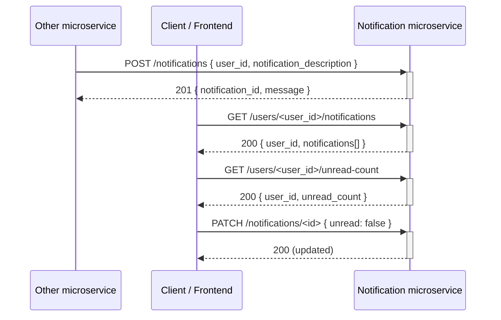

# Notification Microservice

A small notification Python + Flask API. Receives notifications from other microservices, provides notification list and count, and allows for updating
of read/unread status.

## Setup

```bash
python -m venv venv
source venv/bin/activate   # Windows: venv\Scripts\activate
pip install -r requirements.txt
```

## Run

```bash
python app.py
```

## API

| Method | Endpoint | Description |
|--------|----------|-------------|
| POST | `/notifications` | Receive a notification. Body: `{"user_id": "...", "notification_description": "..."}` |
| GET | `/users/<user_id>/notifications` | Get all notifications for a user (newest first) |
| PATCH | `/notifications/<notification_id>` | Mark as read/unread. Body: `{"unread": true}` or `{"unread": false}` |
| GET | `/users/<user_id>/unread-count` | Get unread notification count for a user |

## How to programmatically REQUEST data from this microservice

Data is requested from this microservice by sending HTTP GET requests to the appropriate endpoints. Example in Python:

```python
import requests

BASE_URL = "http://127.0.0.1:8001"
user_id = "alice"

response = requests.get(f"{BASE_URL}/users/{user_id}/notifications")
notifications = response.json()
```

Use the returned JSON as needed.

## How to programmatically RECEIVE data from this microservice

Data is received from this microservice when other services POST new notifications to it. Example in Python:

```python
import requests

BASE_URL = "http://127.0.0.1:8001"

response = requests.post(
    f"{BASE_URL}/notifications",
    json={
        "user_id": "alice",
        "notification_description": "Someone liked your activity",
    },
    headers={"Content-Type": "application/json"},
)

result = response.json()
```

## UML sequence diagram



